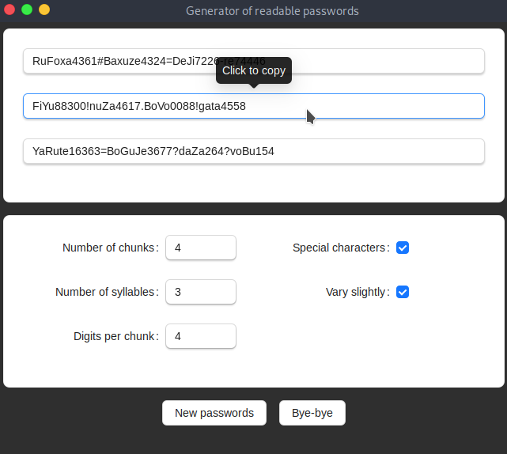

# Generator of readable passwords


This is intended to be a way to generate somewhat secure random passwords that can be read. This makes it easier to type them, especially on phones.

## Building the app
[Here](https://tauri.app/v1/guides/getting-started/prerequisites) is the current doc on how to build a Tauri app. I've had some problems with the ```libayatana-appindicator3-dev``` packet on Debian, but coult install it from backports. Your npm installation shout also include the Tauri CLI tools, they can be installed by running ```npm install @tauri-apps/cli```

Then you can simply build it by
~~~
npm run tauri build
~~~

## Credits
### Tauri
This project uses [Tauri](https://tauri.app/) to create a cross-platform application.

### ReactJS
This project uses [React](https://reactjs.org/) to create the user interface.
